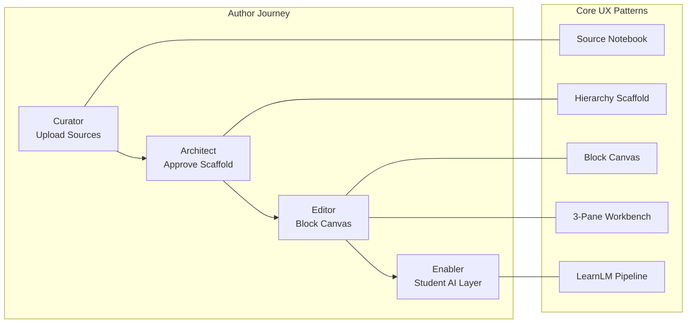
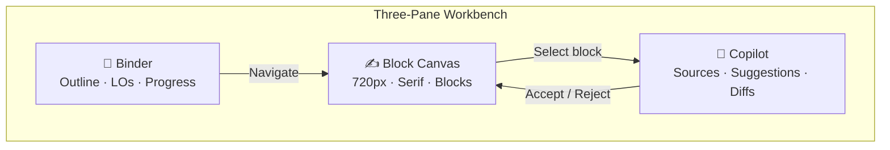
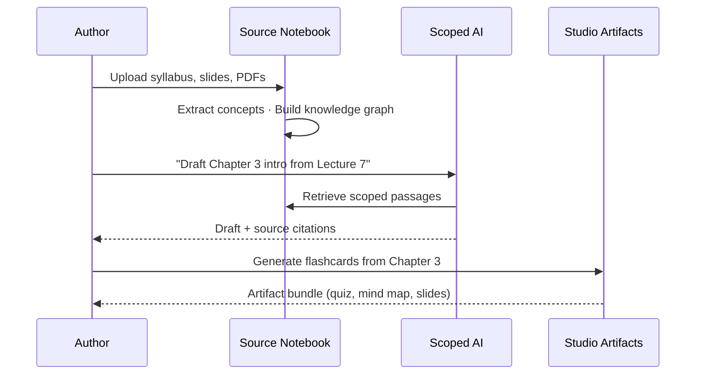
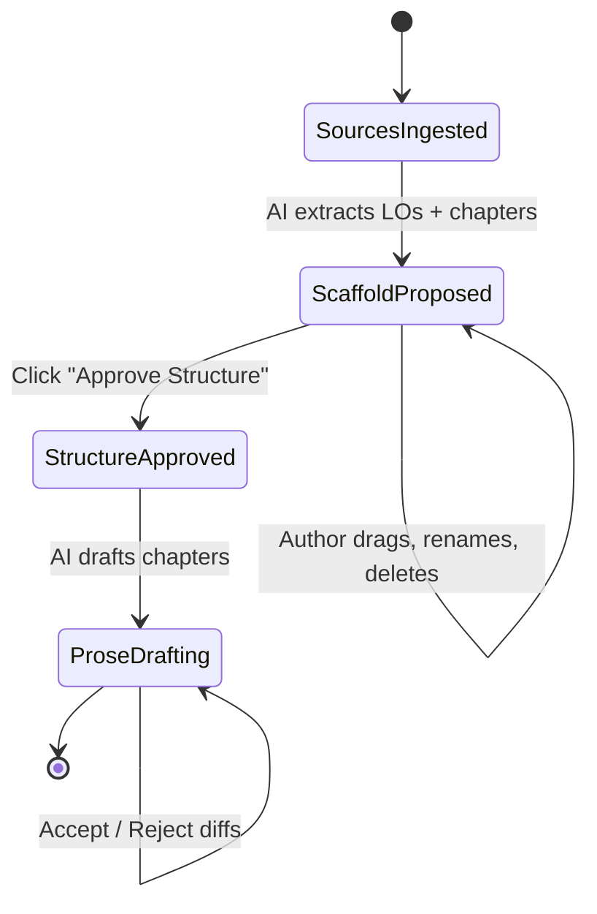
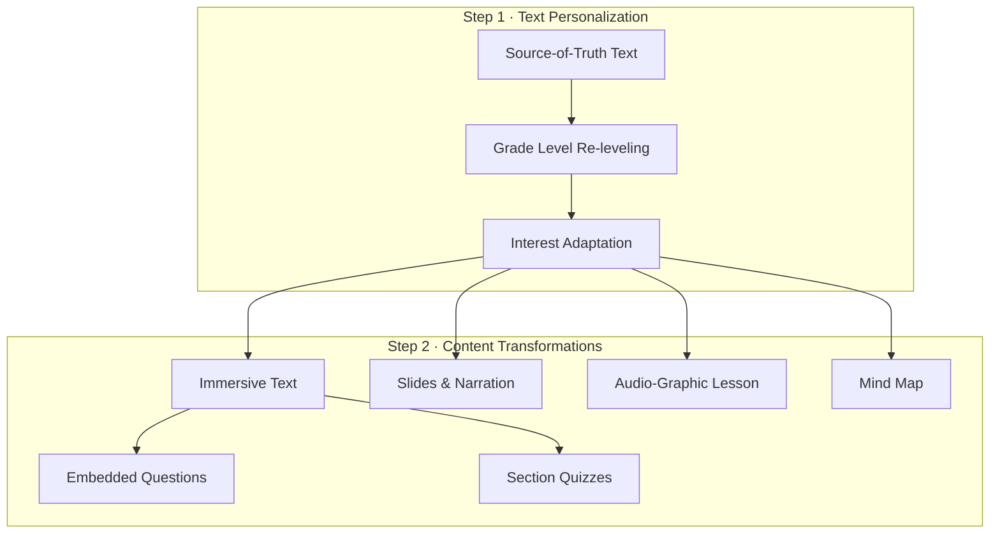
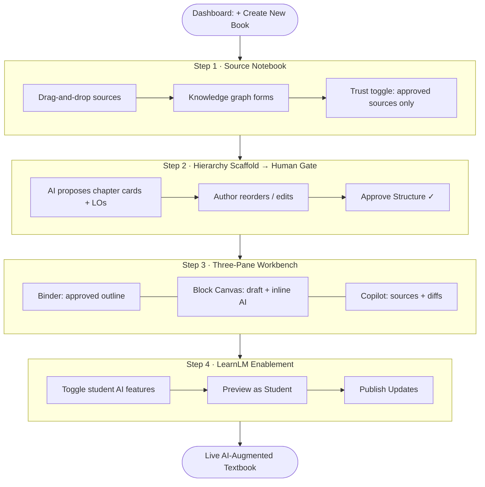

# UX Research Findings — AI-Augmented Textbook Authoring

> **DreamBook Studio · Design Pattern Synthesis**  
> Synthesized from Reference UX screenshots, Google LearnLM research (*Towards an AI-Augmented Textbook*, arXiv:2509.13348), market research (NotebookLM, Notion AI, SciSpace, Consensus), and the `ds_codebase` prototype.  
> **Last updated:** June 16, 2026

---

## Executive Summary

Professors and textbook authors **do not want a generic chat box**. They want a **structured, source-grounded pipeline** that respects academic integrity, keeps them in control, and progressively reveals AI capability only when needed.

The research converges on five architectural patterns and a single meta-principle:


| Principle                     | Implication                                                                                          |
| ----------------------------- | ---------------------------------------------------------------------------------------------------- |
| **Source-first**              | AI must be grounded in author-approved materials before generating prose or student-facing artifacts |
| **Structure before prose**    | Generate outlines and learning objectives before drafting chapters                                   |
| **Human gates at every tier** | Authors approve structure, accept/reject diffs, and toggle student enablements                       |
| **Familiar workbench layout** | Three-pane architecture (Binder · Canvas · Copilot) reduces cognitive load for non-technical users   |
| **Author → Student pipeline** | Separate "write the book" from "enable AI for learners" (LearnLM two-step model)                     |





---

## 1. Three-Pane Workbench Architecture

The dominant layout pattern across Reference UX, Scrivener, Notion, SciSpace, and the Living Canvas design system. Non-technical professors recognize it immediately — it signals *"I'm in a serious authoring tool, not a chatbot."*

### Pane Responsibilities


| Pane                          | Width                           | Role                       | Content                                                                        |
| ----------------------------- | ------------------------------- | -------------------------- | ------------------------------------------------------------------------------ |
| **Left — The Binder**         | ~280px (slim)                   | Navigation & structure     | Approved chapter outline, section tree, progress rail, concept links           |
| **Center — The Block Canvas** | ~720px max (golden line length) | Primary authoring surface  | Notion-style blocks, serif reading typography, inline AI sparks, diff overlays |
| **Right — Copilot / Sources** | ~400–480px                      | AI enrichment & provenance | Scoped suggestions, source citations, accept/reject actions, audience tweaks   |


### Visual Language (Living Canvas)


| Element           | Treatment                                      | Purpose                                      |
| ----------------- | ---------------------------------------------- | -------------------------------------------- |
| Center canvas     | Warm cream background (`#faf8ff`)              | Deep-work reading/writing zone               |
| Right panel       | Cool neutral gray (`surface-container-lowest`) | Distinguishes tools from content             |
| Progress rail     | Slim vertical bar, Academic Blue fill          | Chapter reading/authoring progress           |
| Anchor highlights | Amber bottom-border + gold glow on hover       | Cross-reference and AI-suggested enrichments |





### Why It Wins

- **Spatial memory:** Authors always know where they are in the book (left) and what AI is proposing (right).
- **No modal trap:** AI assistance lives in a persistent panel, not a pop-over that obscures the manuscript.
- **Dual-surface backgrounds:** Warm center + cool tools panel reduces eye strain during long authoring sessions.

---

## 2. Source Notebook → Scoped Query → Studio Artifacts

*Inspired by NotebookLM*

NotebookLM's core insight: **ground AI in user-selected sources first**, then let authors query and generate artifacts *only from that corpus*. This directly addresses the #1 author fear — hallucination.

### Flow Stages


| Stage                   | User Action                                                           | System Response                                                            | Trust Signal                                       |
| ----------------------- | --------------------------------------------------------------------- | -------------------------------------------------------------------------- | -------------------------------------------------- |
| **1. Source Notebook**  | Drag-and-drop syllabus, lecture slides, past exams, PDFs, voice notes | Ingest, index, extract concepts; visualize forming knowledge graph         | *"AI will only use these approved sources"* toggle |
| **2. Scoped Query**     | Ask questions or request drafts scoped to selected sources/chapters   | Responses cite specific source passages; no open-web retrieval by default  | Inline source chips linking to original PDF pages  |
| **3. Studio Artifacts** | Generate derivative outputs from the grounded corpus                  | Mind maps, flashcards, quizzes, slide decks, audio overviews, study guides | Each artifact tagged with source lineage           |





### NotebookLM Artifact Types to Emulate


| Artifact       | Author Use Case                          | Student Use Case               |
| -------------- | ---------------------------------------- | ------------------------------ |
| Mind Map       | Validate concept coverage before writing | Navigate chapter structure     |
| Flashcards     | Review key terms extracted from sources  | Spaced-repetition study        |
| Quiz           | Pre-publish formative assessment check   | Inline knowledge checks        |
| Slide Deck     | Lecture companion generation             | Alternative modality (LearnLM) |
| Audio Overview | Author listens while commuting           | Podcast-style review           |
| Study Guide    | Exam prep material from corpus           | Exam cram sheet                |


### Key Design Rules

1. **Never start with a blank page** — start with "feed the Brain."
2. **Scope is explicit** — authors select which sources apply to each chapter/query.
3. **Artifacts are outputs, not the editor** — the Block Canvas remains the source of truth; Studio Artifacts are generated alongside it.

---

## 3. Hierarchy Scaffold → Human Gate

*Inspired by Notion AI and Chelle*

Authors are **architects**, not prompt engineers. The system proposes structure; the human approves before any prose is generated.

### Flow


| Step           | Pattern                               | Interaction                                                                  | Gate                                                                   |
| -------------- | ------------------------------------- | ---------------------------------------------------------------------------- | ---------------------------------------------------------------------- |
| **Extract**    | AI parses uploaded sources            | Surfaces learning objectives, topic clusters, prerequisite chains            | —                                                                      |
| **Scaffold**   | AI proposes chapter/section hierarchy | Planning board with draggable chapter cards (Kanban or Notion database view) | —                                                                      |
| **Human Gate** | Author reviews structure              | Drag-reorder, rename, merge, delete chapters; edit LOs per card              | `**Approve Structure`** button — blocks prose generation until clicked |
| **Draft**      | AI generates chapter content          | Only after approval; scoped to approved LOs and sources                      | Per-chapter diff accept/reject                                         |





### Why the Gate Matters


| Without Gate                                   | With Gate                                              |
| ---------------------------------------------- | ------------------------------------------------------ |
| AI generates 40 pages of wrong-structure prose | Author fixes 10 chapter cards in 5 minutes             |
| Author feels AI "took over"                    | Author feels like architect, AI is drafter             |
| Expensive regeneration loops                   | Cheap structural iteration before token-heavy drafting |


### Chelle / Notion AI Patterns Borrowed

- **Database-view planning board** for chapter cards with metadata (LOs, source count, estimated length)
- **Inline property editing** on cards (audience level, difficulty, prerequisites)
- **Progressive disclosure** — structure first, prose second, enrichments third

---

## 4. Block Canvas + Contextual AI Blocks

*Inspired by Notion, Lexical editors, Medium, and the `editor.html` prototype*

The center pane is a **block-based editor** where every content unit (paragraph, heading, diagram, quiz embed) is an independent block with its own AI affordances.

### Block Types & AI Behaviors


| Block Type          | AI Spark Trigger                        | Contextual Actions                                         |
| ------------------- | --------------------------------------- | ---------------------------------------------------------- |
| Paragraph           | Analytics flag "students struggle here" | Simplify · Add analogy · Add real-world example · Re-level |
| Heading             | Missing LO alignment                    | Suggest learning objectives · Merge/split sections         |
| Diagram placeholder | Static figure detected                  | Make interactive · Generate simulation · Add alt-text      |
| Assessment embed    | Post-draft enablement                   | Generate MCQs · Socratic prompts · Sandbox scenario        |


### Contextual AI Block Anatomy

```
┌─────────────────────────────────────────────────────┐
│  ✨ AI Spark (left gutter)                          │
│                                                     │
│  Paragraph text with [anchor highlight] for the     │
│  passage under AI review...                         │
│                                                     │
└─────────────────────────────────────────────────────┘
         │
         ▼ (click spark or highlight)
┌─────────────────────────────────────────────────────┐
│  Right Panel: Suggestion Card                       │
│  ─ Issue: "68% of students fail to grasp..."       │
│  ─ Suggestion: Relatable analogy                    │
│  ─ Source: author_original_ideas.md                 │
│  ─ [Accept & Insert] [Edit] [Reject]               │
│  ─ Audience chips: Simpler · Academic · Sports      │
└─────────────────────────────────────────────────────┘
```

### Floating Action Bar (Block-Level)

Persistent bottom-center FAB for canvas-wide actions:


| Action           | Icon Intent                | Scope                  |
| ---------------- | -------------------------- | ---------------------- |
| Add Voice Note   | Author records explanation | Current section        |
| Make Interactive | Transform static → dynamic | Selected diagram block |
| AI Rewrite       | Regenerate selected block  | Highlighted text       |


### Diff Overlay Pattern

When AI modifies existing prose, **never silently overwrite**:


| Visual                  | Meaning                 |
| ----------------------- | ----------------------- |
| Green highlight         | AI addition             |
| Red strikethrough       | AI deletion             |
| `[Accept]` / `[Reject]` | Explicit author control |


### Anchor Analogy Elements

Heritage Gold chips pin cross-references and AI-generated analogies to specific passages — visually distinct from body text so authors (and students) know what's enriched vs. canonical.

---

## 5. LearnLM Two-Step Pedagogical Pipeline

*From Google's "Towards an AI-Augmented Textbook" (Learn Your Way system)*

LearnLM validates DreamBook's split between **authoring** and **student enablement**. The paper proves a two-step generation scheme improves learning efficacy in a randomized controlled trial (p = 0.03 immediate and retention assessments).

### The Two Steps


| Step  | Name                        | Input                                                                      | Output                                                             | DreamBook Studio Mapping                                               |
| ----- | --------------------------- | -------------------------------------------------------------------------- | ------------------------------------------------------------------ | ---------------------------------------------------------------------- |
| **1** | **Text Personalization**    | Source-of-truth chapter text + learner attributes (grade level, interests) | Re-leveled, relatable prose with highlighted personalized passages | Author configures audience presets; system re-levels for target cohort |
| **2** | **Content Transformations** | Personalized text                                                          | Multiple representations + formative assessment                    | Author toggles student-facing AI enhancements per chapter              |





### Step 2 Artifact Catalog (LearnLM-Proven)


| Transformation           | Pedagogical Role                                              | Author Toggle Label     |
| ------------------------ | ------------------------------------------------------------- | ----------------------- |
| **Immersive Text**       | Comprehensive personalized prose with interleaved enrichments | Core reading experience |
| **Timeline**             | Visual sequence for historical/process content                | Auto-detect sequences   |
| **Memory Aid**           | AI-generated mnemonics for hard-to-memorize facts             | Generate mnemonics      |
| **Visual Illustrations** | Personalized diagrams tied to learner interests               | Generate illustrations  |
| **Slides & Narration**   | Brief class-like overview + optional narration                | Generate slide deck     |
| **Audio-Graphic Lesson** | Teacher-student dialogue + dynamic concept graph              | Generate audio lesson   |
| **Mind Map**             | Hierarchical concept overview, expandable nodes               | Generate mind map       |
| **Embedded Questions**   | Inline MCQs at passage level (click-to-reveal)                | Enable formative checks |
| **Section Quizzes**      | 5–10 MCQs with Glows/Grows feedback                           | Enable chapter quiz     |


### Author Enablement Panel (DreamBook Translation)

After prose is finalized, authors enter the **Student Experience Configuration**:


| Toggle                     | Behavior                           | Grounding Rule                       |
| -------------------------- | ---------------------------------- | ------------------------------------ |
| Generate Formative Quizzes | Inline MCQs from chapter text only | No external knowledge                |
| Enable Socratic Chat       | Guides, never gives direct answers | Scoped to chapter + approved sources |
| Create Sandbox Scenario    | Real-world application simulation  | Based on chapter LOs                 |
| Preview as Student         | Full-fidelity student view         | `[👁️ Preview as Student]` in header |


### Research-Backed Constraints


| Constraint                      | Rationale (LearnLM)                                                   |
| ------------------------------- | --------------------------------------------------------------------- |
| Maintain source factuality      | Pedagogy experts rated accuracy > 0.90 across components              |
| Highlight personalized passages | Informs learner what's adapted to their interests                     |
| Offer modality choice           | Dual coding theory — multiple representations reinforce mental models |
| Formative assessment embedded   | "Assessment is for self-regulated learning" (Clark, 2012)             |


---

## 6. End-to-End Create Textbook Flow

Synthesizing all five patterns into a single author journey:




### Role Progression


| Phase              | Author Role   | Primary Pattern                 |
| ------------------ | ------------- | ------------------------------- |
| Source upload      | **Curator**   | Source Notebook                 |
| Structure approval | **Architect** | Hierarchy Scaffold → Human Gate |
| Chapter drafting   | **Editor**    | Block Canvas + 3-Pane Workbench |
| Student config     | **Enabler**   | LearnLM Two-Step Pipeline       |


---

## 7. Top 10 Design Patterns — Steal List

Patterns ranked by impact on non-technical author confidence and alignment with LearnLM research.


| #      | Pattern                               | Steal From                                    | DreamBook Application                                                               |
| ------ | ------------------------------------- | --------------------------------------------- | ----------------------------------------------------------------------------------- |
| **1**  | **Three-Pane Workbench**              | Scrivener · Notion · SciSpace · Living Canvas | Binder (left) · Block Canvas (center) · Copilot (right) — default authoring layout  |
| **2**  | **Source Notebook with Trust Toggle** | NotebookLM                                    | Drag-and-drop ingest + *"AI uses approved sources only"* commitment                 |
| **3**  | **Hierarchy Scaffold → Human Gate**   | Notion AI · Chelle                            | Chapter cards with LOs; block prose until `Approve Structure`                       |
| **4**  | **Diff Overlay (Accept / Reject)**    | Cursor · Google Docs Suggest                  | Never silently overwrite author prose; green/red diff with explicit actions         |
| **5**  | **AI Spark Block Indicators**         | `editor.html` prototype                       | Gutter ✨ icons on blocks with analytics-driven suggestions                          |
| **6**  | **Scoped Source Citations**           | NotebookLM · Consensus · SciSpace             | Every AI suggestion shows which uploaded file/passage it came from                  |
| **7**  | **Knowledge Graph on Upload**         | NotebookLM · Concept Mastery Graph vision     | Visual concept extraction as files ingest — builds author trust                     |
| **8**  | **Inline Floating AI Toolbar**        | Notion AI · Medium                            | Highlight text → contextual actions (Simplify · Diagram · Example)                  |
| **9**  | **Preview as Student**                | LearnLM · LMS preview modes                   | Full-fidelity toggle before publish; author sees quizzes, chat, sandbox             |
| **10** | **LearnLM Two-Step Pipeline**         | Google LearnLM paper                          | Separate personalization (Step 1) from multi-modal transforms + assessment (Step 2) |


### Honorable Mentions


| Pattern                           | Source        | Notes                                                      |
| --------------------------------- | ------------- | ---------------------------------------------------------- |
| Audience tweak chips              | `editor.html` | "Make it simpler" · "More academic" · "Use sports analogy" |
| Progress suggestion counter       | `editor.html` | "3 of 12 AI Suggestions Reviewed" in header                |
| Context Library (Cursor-inspired) | DSvision.md   | Drive MCP for notes, research, courseware                  |
| Socratic / Adversarial Copilot    | DSvision.md   | Sandbox where AI copy-paste doesn't work                   |
| Glows / Grows quiz feedback       | LearnLM       | Strengths vs. improvement areas post-quiz                  |


---

## 8. Anti-Patterns to Avoid


| Anti-Pattern                      | Why It Fails                         | Alternative                               |
| --------------------------------- | ------------------------------------ | ----------------------------------------- |
| Blank-page start                  | Cold-start paralysis for professors  | Source Notebook first                     |
| Generic chat sidebar              | No structure, no trust, no citations | Scoped Copilot panel with sources         |
| Silent AI overwrite               | Authors lose ownership               | Diff overlay with accept/reject           |
| Student AI before author approval | Integrity and quality risks          | LearnLM Step 2 only after prose finalized |
| One-size-fits-all generation      | Ignores audience and LO alignment    | Hierarchy scaffold + audience presets     |


---

## 9. Source References


| Source                      | Location                         | Key Contribution                                                   |
| --------------------------- | -------------------------------- | ------------------------------------------------------------------ |
| Google LearnLM Paper        | `Research/2509.13348v4.pdf`      | Two-step pipeline, Immersive Text, RCT efficacy results            |
| Perplexity Market Research  | `Research/perplexityresearch.md` | NotebookLM, Consensus, SciSpace, Elicit tool landscape             |
| Reference UX Screenshots    | `Reference UX/` (80+ images)     | Split-screen layouts, inline annotations, AI chat patterns         |
| Living Canvas Design System | `ds_codebase/DESIGN.md`          | Three-pane layout, typography, color, elevation                    |
| Chapter Editor Prototype    | `ds_codebase/editor.html`        | AI sparks, copilot panel, FAB, preview button                      |
| Product Vision              | `DSvision.md`                    | Feynman technique, sandbox, concept mastery graph, context library |


---

## 10. Open Questions for Prototype


| Question                                      | Options                                          | Recommendation                                                       |
| --------------------------------------------- | ------------------------------------------------ | -------------------------------------------------------------------- |
| Planning board vs. tree outline for scaffold? | Kanban cards · Nested tree · Both                | Start with cards (Chelle); add tree in Binder after approval         |
| When to show knowledge graph?                 | Upload · Post-scaffold · Always                  | During upload (trust-building moment)                                |
| Copilot panel default state?                  | Empty · Proactive suggestions · Analytics-driven | Analytics-driven sparks on blocks with known student struggle points |
| How many Studio Artifacts upfront?            | All at once · On-demand · Chapter-scoped         | Chapter-scoped generation to avoid overwhelm                         |


---

*This document is a living reference for DreamBook Studio UX decisions. Update as prototype learnings emerge.*